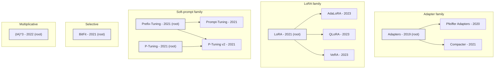

# PEFT Knowledge Graph & Reasoning System

A knowledge graph of the parameter-efficient fine-tuning (PEFT) literature, plus
a reasoning engine that positions a **new, unseen** PEFT idea against it —
returning the closest existing method, a suggested reading order, what has
already been tried, and a novelty flag.

- **What it models & why:** see [`approach.md`](approach.md)
- **The normative schema (every node/edge passes a test):** see [`schema.md`](schema.md)

---

## Quickstart

Requires Python 3.10+. The reasoning engine and validator have **no
dependencies**; only the corpus fetcher needs `requests`.

```bash
# 1. Inspect / validate the knowledge base
python src/validate_graph.py

# 2. Run the reasoning engine on a new PEFT idea
python src/suggest_method.py "We add a trainable low-rank update to frozen attention
  weights, choosing the rank per layer via SVD importance scores."

# JSON output instead of formatted sections
python src/suggest_method.py --json "train only the bias terms, add no new parameters"

# From a file, or from stdin
python src/suggest_method.py --file idea.txt
echo "your idea" | python src/suggest_method.py
```

> On Windows the launcher is `py` instead of `python`.

### Example output (abridged)

```
1. CLOSEST TRACKED METHODS
   1. Compacter    score=0.778 sig=4  ###############
      mechanism: Adapters whose weight matrices are Kronecker products of shared
                 low-rank / hypercomplex factors, cutting adapter parameters.
      matched on: adapter, factors, kronecker, low-rank, products, shared
2. SUGGESTED READING ORDER (root -> match -> your idea)
   Adapters  ->  Compacter  ->  <your idea>
3. ALREADY TRIED IN THIS DIRECTION
   sibling variants (same parent): Pfeiffer Adapters
   its results-table baselines  : Adapters, BitFit, Prompt-Tuning
4. NOVELTY FLAG
   [LIKELY_DUPLICATE] Description is very close to 'Compacter' (score 0.778,
   4 signature terms). Verify it is not just Compacter re-described.
```

---

## The knowledge base — `graph.json`

Self-describing: mechanism descriptions live on the Method nodes, so the full
taxonomy is readable **without running any code**.

| | Count |
|---|---|
| **Method** nodes (with `mechanism`, `family`, `is_family_root`, `signature_terms`) | 13 |
| **Paper** nodes | 68 |
| **Benchmark** nodes | 18 |
| **INTRODUCES** (Paper→Method) | 13 |
| **EXTENDS** (Method→Method) | 8 |
| **COMPARED_AGAINST** (Method→Method, w/ `evidence_paper`) | 29 |
| **EVALUATED_ON** (Method→Benchmark) | 34 |
| **APPLIES** (Paper→Method) | 72 |

Six family roots: **Adapters, Prefix-Tuning, P-Tuning, LoRA, BitFit, (IA)³.**
Everything else is a variant connected by an `EXTENDS` edge.

### Method taxonomy (the `EXTENDS` family tree)

Grouped by mechanism family; arrows point from a method to the variant that
extends it. Roots (outlined) define a family's mechanism; everything else
reduces to a root under the test in [`approach.md`](approach.md). Generated from
`graph.json` by `src/render_mermaid.py`, so it cannot drift from the data.



Note P-Tuning v2 has **two** parents (P-Tuning and Prefix-Tuning) — it merges
both, which the `EXTENDS` DAG represents directly.

---

## Layout

```
.
├── graph.json                        # ⭐ THE deliverable — the knowledge graph
├── schema.md                         # normative schema: definitions as falsifiable tests
├── approach.md                       # design rationale & decision narrative
├── README.md                         # this file
├── requirements.txt                  # just `requests` (only the fetcher needs it)
├── src/
│   ├── suggest_method.py             # ⭐ reasoning engine — positions a new PEFT idea
│   ├── validate_graph.py             # executable validation suite (schema.md §4)
│   ├── render_mermaid.py             # regenerates the taxonomy diagram from graph.json
│   ├── fetch_papers.py               # corpus fetcher (Semantic Scholar batch endpoint)
│   └── tag_applies.py                # builds/merges the APPLIES review worksheet
└── data/
    ├── papers_candidates.json        # raw fetch output (provenance)
    └── papers_applies_review.json    # 200 candidates + keep/reject, reason/confidence/evidence
```

Scripts resolve `graph.json` and `data/` relative to the repo root, so they run
from any working directory.

---

## Reproducing the pipeline

```bash
# (a) fetch the candidate corpus  (needs `pip install -r requirements.txt`)
python src/fetch_papers.py             # -> data/papers_candidates.json

# (b) build the APPLIES review worksheet, tag it, merge accepted rows
python src/tag_applies.py              # -> data/papers_applies_review.json
#   ... review / set keep + applies_methods ...
python src/tag_applies.py --merge      # -> merges APPLIES edges into graph.json

# (c) validate
python src/validate_graph.py           # must pass with 0 errors
```

The method taxonomy, EXTENDS edges, and the 13 papers' COMPARED_AGAINST /
EVALUATED_ON edges are **curated** (read from papers), not fetched — see
[`approach.md`](approach.md) §4 for why that split exists.

---

## Design principle

> A smaller graph where every edge has a falsifiable test beats a larger graph
> where edges mean "somebody mentioned this somewhere."

Every node and edge passes a test written in `schema.md`; `validate_graph.py`
enforces those tests as code and currently passes with **0 errors, 0 warnings**.
