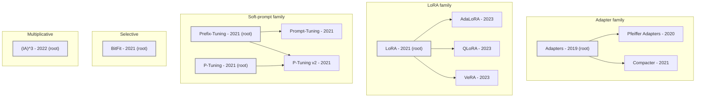

# PEFT Knowledge Graph & Reasoning System

> Raw literature is searchable but not *understandable*. A researcher entering the
> parameter-efficient fine-tuning (PEFT) field spends weeks reconstructing a map
> that should already exist: what's foundational, what extends what, what's been
> tried, and whether a new idea is actually novel.

This project builds that map as a **knowledge graph** — 13 PEFT methods, 68 papers,
18 benchmarks, and five typed relationship types, every edge backed by a
falsifiable test — and then puts a **reasoning engine** on top of it. Describe a
*new, unseen* PEFT idea in plain English and the system reasons over the graph to
tell you: the closest existing method, a reading path to understand it, what's
already been tried in that direction, and whether it looks novel.

**Three ways to see it, fastest first:**

| | |
|---|---|
| 🖱️ **Explore it** | Open [`graph.html`](graph.html) in any browser — a self-contained interactive graph (no install, works offline). Click a method to reveal its papers + a fact panel; click any node to open the real paper. |
| ⚡ **Reason over it** | `python src/suggest_method.py "your PEFT idea"` — positions a *new* idea against the graph (see [worked example](#the-reasoning-engine-new-input--structured-output) below). |
| 🔎 **Let it reason about itself** | `python src/graph_insights.py` — surfaces structural tensions *derived* from the edges (comparisons on disjoint benchmarks, uncontested frontier methods). See [Graph self-analysis](#graph-self-analysis--the-graph-reasoning-about-itself). |
| ❓ **Ask why an edge exists** | `python src/explain_edge.py --from AdaLoRA --to LoRA --edge EXTENDS` — pulls the falsifiable test/evidence behind any single edge. See [Explain this edge](#explain-this-edge--auditability-as-a-query-not-a-grep). |
| 📖 **Understand the design** | [`approach.md`](approach.md) — the decision narrative (read this first). [`schema.md`](schema.md) — the normative schema. |

> **On the one hard constraint (no auto-extraction tools):** the entity types, the
> relationship schema, the family/variant taxonomy, and every tagging decision are
> mine. The Semantic Scholar API supplied only raw bibliographic data (titles,
> abstracts, citation links); an LLM was used only as an assistant *applying* my
> rules at scale, never to decide the structure. See [`approach.md`](approach.md).

---

## The reasoning engine (new input → structured output)

This is the core requirement: accept something **not in the dataset** and produce a
structured, graph-grounded answer. The match is only the entry point — the
*reasoning* is graph traversal (walk `EXTENDS` for the reading path, pull
`COMPARED_AGAINST` neighbours for prior work).

**Example — a genuinely novel idea the graph has never seen:**

```bash
python src/suggest_method.py "represent each weight update as a learned rotation
  in a Lie-group tangent space rather than an additive delta"
```
```
1. CLOSEST TRACKED METHODS
   1. LoRA               score=0.133 sig=0 ##
      mechanism: Adds a trainable low-rank update B*A to frozen weight matrices (W + BA); mergeable at inference, no extra latency.
      matched on: update, weight

2. MECHANISM CONTRAST vs LoRA
   shares diagnostic mechanism : (none)
   LoRA-defining terms NOT in your idea: low-rank, lora, rank, decomposition, mergeable, reparameterization
   family placement            : 'reparameterization' (roots: LoRA); match is a ROOT

6. NOVELTY VERDICT
   [APPEARS_DISTINCT]
   Structurally it lands in the 'reparameterization' family (roots: LoRA); the match is a root.
   -> To be more than 'LoRA' re-described, the idea must differ on its defining mechanism -- 'LoRA' is characterised by [low-rank, lora, rank, decomposition], which your description does not mention. State how you depart from those (or confirm you inherit them) to settle novelty.
```
It refuses to call a Lie-group idea "basically LoRA" just because both say "weight
update" — `sig=0` means zero diagnostic signature terms matched, only the generic
prose words "update" and "weight," and the verdict reflects that: APPEARS_DISTINCT,
not a duplicate. A deliberate guard against the failure mode of lexical matching.

**Example — an idea that IS close to something tracked:**

```bash
python src/suggest_method.py "add a low-rank update to frozen weights, but choose
  the rank per layer using SVD importance scores"
```
```
1. CLOSEST TRACKED METHODS
   1. AdaLoRA            score=0.585 sig=4 ###########
      mechanism: LoRA with adaptive rank: allocates the rank budget across weight matrices via SVD-based importance pruning of singular values.
      matched on: importance, low-rank, rank, svd

2. MECHANISM CONTRAST vs AdaLoRA
   shares diagnostic mechanism : rank, svd, importance, low-rank
   AdaLoRA-defining terms NOT in your idea: adaptive, budget, singular, prune, allocation
   family placement            : 'reparameterization' (roots: LoRA); match is a VARIANT (reduces to root)

4. SUGGESTED READING ORDER (root -> match -> your idea)
   LoRA  ->  AdaLoRA  ->  <your idea>

5. ALREADY TRIED IN THIS DIRECTION
   variants extending the match : (none)
   sibling variants (same parent): QLoRA, VeRA
   its results-table baselines  : Adapters, BitFit, LoRA, Pfeiffer Adapters
   applied in practice by       : 0 paper(s) (APPLIES edges)
   ! No APPLIES papers for 'AdaLoRA' in this corpus, so the 'who runs this in practice' signal is UNAVAILABLE for this match (a known coverage limitation: the APPLIES tier is LoRA-heavy). The EXTENDS/COMPARED_AGAINST reasoning above is unaffected -- those edges are curated from the papers, not abstract-tagged.

6. NOVELTY VERDICT
   [LIKELY_DUPLICATE]
   Structurally it lands in the 'reparameterization' family (roots: LoRA); the match is a variant that reduces to that root.
   -> To be more than 'AdaLoRA' re-described, the idea must differ on its defining mechanism -- 'AdaLoRA' is characterised by [adaptive, budget, singular, prune], which your description does not mention. State how you depart from those (or confirm you inherit them) to settle novelty.
```

The verdict doesn't just say "verify it isn't AdaLoRA" — it names the **exact mechanism
axes** (from AdaLoRA's own diagnostic terms in the graph) the idea would have to depart
from to be novel, and locates it structurally in the family tree. The reasoning is
graph-grounded: the contrast terms and the family/root placement come from the Method
nodes and the `EXTENDS` DAG, not from the query text. Notice, too, that section 5 states
the APPLIES-coverage limitation outright for this match rather than a bare "(none)" —
see [Disclosed limitation](#the-knowledge-graph--graphjson) below.

**Cross-family signal.** An idea that names an *orthogonal* technique — e.g. "low-rank
adapters on a 4-bit quantized base" — additionally surfaces the graph's precedent for that
combination (QLoRA carries `combined_techniques: [quantization]`), so the tool reasons over
the schema's orthogonal-axis decision, not only the mechanism taxonomy.

Output as `--json` for machine use, `--file idea.txt` or stdin for piping. Full CLI
in [Quickstart](#quickstart).

---

## Graph self-analysis — the graph reasoning about *itself*

`suggest_method.py` reasons about a **new** input. `graph_insights.py` reasons about
the knowledge state that is *already there* — it surfaces structural tensions that no
single edge states, each **derived** by combining edge types. This is the clearest
demonstration that the structure buys something a document store can't: these facts
aren't stored anywhere; they're computed from how the edges line up.

```bash
python src/graph_insights.py
```
```
1. UNGROUNDED COMPARISONS  (7)
   'X benchmarks against Y' but X and Y report on disjoint benchmarks.
   - (IA)^3 -> LoRA
       (IA)^3 on ['raft', 't0_heldout']
       LoRA   on ['e2e_nlg', 'glue', 'samsum', 'wikisql']   (no overlap)
   ...
2. UNCONTESTED METHODS  (5)  -- nobody benchmarks against these
   - AdaLoRA (2023-03-18) · QLoRA (2023-05-23) · VeRA (2023-10-17) ...
3. BENCHMARK-ISOLATED METHODS  (1)
   - (IA)^3   only on ['raft', 't0_heldout'] -- shares with nothing else
4. APPLIES COVERAGE  (72 edges; disclosed limitation)
   LoRA 50 · QLoRA 9 · Adapters 7 · Prompt-Tuning 5 · BitFit 1 · (8 methods at 0)
   -> the 'who runs this in practice' signal is reliable for LoRA-family ideas and
      unavailable for the rest -- reported per-query, not hidden.
```

Three independent detectors converge on **(IA)³**: it's benchmark-isolated, nobody
benchmarks against it, *and* all six of its results-table comparisons are on suites
the compared methods never report. That's a real, non-obvious methodological caveat
— "you can't read (IA)³ vs LoRA as a head-to-head" — that the graph **finds on its
own** by cross-referencing `COMPARED_AGAINST` against `EVALUATED_ON`. Every finding is
falsifiable: re-run it against [`graph.json`](graph.json) and check.

- **Ungrounded comparison** = a `COMPARED_AGAINST` edge whose two endpoints have
  disjoint `EVALUATED_ON` benchmark sets.
- **Uncontested method** = never a `COMPARED_AGAINST` *target*; since the edge runs
  newer→older, these are the recent frontier nothing has measured itself against yet.
- **Isolated method** = shares no benchmark with any other method — its numbers sit on
  an evaluation island.

---

## Explain this edge — auditability as a query, not a grep

The schema's whole premise is that every edge is falsifiable. `explain_edge.py` is the
tool that makes that a one-line query instead of a manual grep through `graph.json`
and the review worksheet. Each edge type carries its justification somewhere different
— this tool knows where and pulls it:

```bash
python src/explain_edge.py --from AdaLoRA --to LoRA --edge EXTENDS
```
```
====================================================================
EXPLAIN EDGE
====================================================================
AdaLoRA  --EXTENDS-->  LoRA
  justification               : Uniform rank budget -> plain LoRA. Passes reduction test.

  source     : curated: reduction-test note on the edge in graph.json
  test applied: Reduction test (schema.md): A is a variant of B if disabling/fixing A's novel components recovers B's trainable mechanism unchanged.
====================================================================
```

`APPLIES` edges are keyed by paper id, not a name you'd already know, so get one first
with `--list-edges` (`<paper_id>` below is literally the first id it prints — copy
whichever one you get, they're all real):

```bash
python src/explain_edge.py --list-edges LoRA        # -> lists APPLIES ids for LoRA, e.g. 9aef980ac6e6a1cbc470362a042b75cfb50e2e48
python src/explain_edge.py --from 9aef980ac6e6a1cbc470362a042b75cfb50e2e48 --to LoRA --edge APPLIES
```
```
====================================================================
EXPLAIN EDGE
====================================================================
9aef980ac6e6a1cbc470362a042b75cfb50e2e48  --APPLIES-->  LoRA
  reason                      : FLIPPED TO ACCEPT: 'Vanilla LoRA May Suffice' runs LoRA unmodified to make an empirical point — textbook APPLIES.
  title                       : Learning Rate Matters: Vanilla LoRA May Suffice for LLM Fine-tuning
  evidence quote              : 'Vanilla LoRA May Suffice for LLM Fine-tuning'
  confidence                  : 0.55

  source     : tagged from abstract; logged in data/papers_applies_review.json
  test applied: Disjointness test (approach.md): a paper is APPLIES only if it runs the method's mechanism UNMODIFIED. If it modifies the mechanism, it fails APPLIES and becomes a candidate new Method instead.
====================================================================
```

| Edge type | Where its justification lives |
|---|---|
| `EXTENDS` | a reduction-test `note` on the edge itself |
| `COMPARED_AGAINST` | `evidence_paper` + `note` (which table row backs it) |
| `EVALUATED_ON` | `evidence_paper` |
| `INTRODUCES` | definitional — schema enforces exactly one per method |
| `APPLIES` | `reason` / `confidence` / `evidence` quote from `data/papers_applies_review.json` |

`--list-edges <method>` lists every edge touching a method, so you can find something
to explain without already knowing the exact pair. This tool surfaces no new facts —
it's a lookup, not a reasoner — but it turns "every edge is falsifiable" from a claim
in `approach.md` into something you can verify in one command.

---

## The knowledge graph — `graph.json`

Self-describing: mechanism descriptions live on the Method nodes, so the full
taxonomy is inspectable **without running any code** — open the JSON and read it.

| Node / Edge | Count | What it means |
|---|---:|---|
| **Method** | 13 | a PEFT technique with a distinct parameter-update mechanism |
| **Paper** | 68 | introduces, evidences, or applies a method |
| **Benchmark** | 18 | an evaluation target (GLUE, MMLU, …) |
| `INTRODUCES` (Paper→Method) | 13 | the paper that first defined & named the method |
| `EXTENDS` (Method→Method) | 8 | A modifies B's mechanism *and* reduces to it |
| `COMPARED_AGAINST` (Method→Method) | 29 | B is a baseline row in A's main results table |
| `EVALUATED_ON` (Method→Benchmark) | 34 | the method reports a result on that benchmark |
| `APPLIES` (Paper→Method) | 72 | the paper runs the method *unmodified* |

> **Disclosed limitation:** `APPLIES` coverage is LoRA-heavy (LoRA 50/72; 8 methods
> at zero). This is a *stated, quantified* property — `graph_insights.py` reports it,
> and the reasoning engine says so per-query rather than returning a misleading empty
> result. The curated evidence edges (`INTRODUCES`, `EXTENDS`, `COMPARED_AGAINST`,
> `EVALUATED_ON`) are read from the papers and are *not* affected. See
> [approach.md](approach.md#the-known-limitation-i-chose-to-disclose-rather-than-paper-over).

Six family roots — **Adapters, Prefix-Tuning, P-Tuning, LoRA, BitFit, (IA)³** —
each defining a distinct mechanism; everything else is a variant on an `EXTENDS` edge.

### Method taxonomy (the `EXTENDS` family tree)

Arrows point from a method to the variant that extends it. Roots (outlined) define a
family's mechanism; variants *reduce* to a root under the test in [`approach.md`](approach.md).
Generated from `graph.json` by `src/render_mermaid.py`, so it cannot drift from the data.



Note P-Tuning v2 has **two** parents (P-Tuning *and* Prefix-Tuning) — it merges
both, which the `EXTENDS` DAG represents directly.

---

## How the graph was built (and verified)

The construction cost is **asymmetric**, and the pipeline reflects that:

- **Evidence edges** (`INTRODUCES`, `EXTENDS`, `COMPARED_AGAINST`, `EVALUATED_ON`) were
  built by **reading the 13 introducing papers' method sections and results tables** —
  these need more than an abstract to get right.
- **Breadth edges** (`APPLIES`) were tagged from abstracts at scale, over a candidate
  pool fetched by citation expansion from seed papers.

**Every edge is verified, and I found real errors doing it.** I re-checked all 13
papers' `COMPARED_AGAINST` / `EVALUATED_ON` edges against the actual source tables and
**removed one unsupported edge** (Prompt-Tuning→Prefix-Tuning — the comparison was in
prose, not a results table). I also reviewed the borderline `APPLIES` calls and
**rejected 6 variant-proposals** that had been mis-tagged as applications. Every one of
the 200 tagging decisions carries a `reason`, `confidence`, and `evidence` field in
[`data/papers_applies_review.json`](data/papers_applies_review.json) — the graph is
auditable, not asserted.

> **Design principle:** a smaller graph where every edge has a falsifiable test beats a
> larger graph where edges mean "somebody mentioned this somewhere."
> `src/validate_graph.py` enforces every schema rule as code and passes with **0 errors**.

---

## Quickstart

Requires **Python 3.10+**. The reasoning engine and validator use the **standard
library only**; only the corpus fetcher needs `requests`.

```bash
# validate the knowledge base (schema rules as code) — should print 0 errors
python src/validate_graph.py

# run the tests (reasoning engine + graph self-analysis + edge explainer; stdlib
# unittest, no network) — 34 tests total, one command:
python -m unittest discover -s tests -v

# or run any test file individually:
python tests/test_suggest_method.py
python tests/test_graph_insights.py
python tests/test_explain_edge.py

# reason about the graph itself — structural tensions derived from the edges
python src/graph_insights.py

# ask why a specific edge exists (the falsifiable test/evidence behind it)
python src/explain_edge.py --from AdaLoRA --to LoRA --edge EXTENDS
python src/explain_edge.py --list-edges LoRA

# reason over a new PEFT idea (formatted sections)
python src/suggest_method.py "train only the bias terms, add no new parameters"

# machine-readable output, or read the idea from a file / stdin
python src/suggest_method.py --json "your idea"
python src/suggest_method.py --file idea.txt
echo "your idea" | python src/suggest_method.py
```

> On Windows, use `py` instead of `python`.

---

## Layout

```
.
├── graph.json                        # ⭐ THE knowledge state — the graph (inspectable, self-describing)
├── graph.html                        # ⭐ self-contained interactive visualization (open in browser)
├── approach.md                       # ⭐ design rationale & decision narrative (read first)
├── schema.md                         # normative schema: every definition is a falsifiable test
├── README.md                         # this file
├── requirements.txt                  # just `requests` (only the fetcher needs it)
├── src/
│   ├── suggest_method.py             # ⭐ reasoning engine — positions a new PEFT idea
│   ├── graph_insights.py             # ⭐ graph self-analysis — tensions derived from edges
│   ├── explain_edge.py               # ⭐ "why does this edge exist" — audit any edge in one query
│   ├── validate_graph.py             # executable validation suite (enforces schema.md)
│   ├── render_html.py                # regenerates graph.html from graph.json
│   ├── render_mermaid.py             # regenerates the taxonomy diagram from graph.json
│   ├── fetch_papers.py               # corpus fetcher (Semantic Scholar batch endpoint)
│   ├── tag_applies.py                # builds/merges the APPLIES review worksheet
│   └── vendor/vis-network.min.js     # inlined into graph.html so it works offline
├── tests/                            # 34 tests, stdlib unittest, no network
│   ├── test_suggest_method.py        # reasoning-engine tests (new-input behaviour)
│   ├── test_graph_insights.py        # graph self-analysis tests (findings are falsifiable)
│   └── test_explain_edge.py          # edge-explainer tests (every edge type + error paths)
└── data/
    ├── papers_candidates.json        # raw fetch output (provenance)
    └── papers_applies_review.json    # 200 candidates + keep/reject with reason/confidence/evidence
```

Scripts resolve `graph.json` and `data/` relative to the repo root, so they run from
any working directory. Tests add `src/` to `sys.path` at import time (no packaging,
no install step — consistent with the stdlib-only, zero-dependency design).

---

## Reproducing the pipeline

```bash
pip install -r requirements.txt

python src/fetch_papers.py          # -> data/papers_candidates.json  (Semantic Scholar)
python src/tag_applies.py           # -> data/papers_applies_review.json  (review worksheet)
#   ... set keep + applies_methods on the candidates ...
python src/tag_applies.py --merge   # -> merges accepted APPLIES edges into graph.json
python src/validate_graph.py        # -> must pass with 0 errors
```

The taxonomy, `EXTENDS` edges, and the 13 papers' evidence edges are **curated** (read
from the papers), not fetched — see [`approach.md`](approach.md) for why that split exists.
